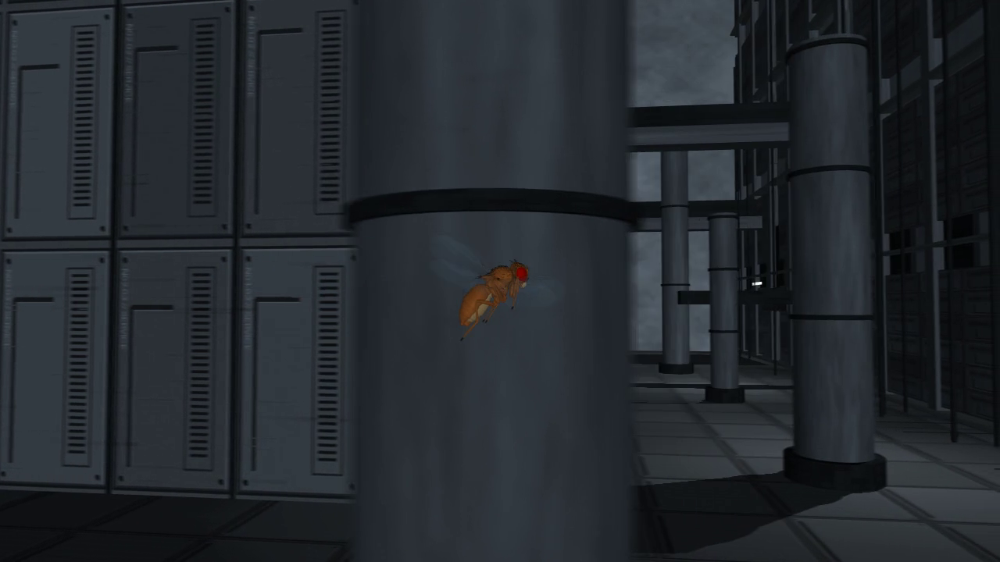

# fly-netsphere

**A connectome reference lab and a physical fruit fly in a BLAME!-inspired megastructure.**

Explore the **NETSPHERE** in a local browser, inspect one anatomical flybody animal,
and stimulate a **127,400-neuron FlyWire reference model** while watching measured
neural activity. An experimental **MN9-to-proboscis link** now drives one body
actuator from simulated motor-neuron spikes. A separate action bar offers sugar,
water, bitter and antennal stimuli, with baseline and blocked-link comparisons.
A transparent inspector keeps measured signals visible and puts explanations in
hover, focus and touch tooltips.
An **object gallery** adds fruit, water, bitter and neutral taste volumes.
Measured mouth contact can trigger and gate a neural response; removing a source
cuts its future input. This is a bounded contact reflex, not autonomous foraging.
[Open the development environment](#interactive-environment-in-the-browser)
or read the [object gallery](docs/habitat.md) and [motor link](docs/motor-link.md).

The animal is the anatomically detailed [flybody](https://github.com/TuragaLab/flybody) model of *Drosophila melanogaster* (Google DeepMind and HHMI Janelia, *Nature* 2025). In the separate recorded-flight pipeline, its pretrained controller runs on CUDA, MuJoCo Warp integrates the body and wing aerodynamics at 20 kHz, and a geometric navigator steers the fly through the collidable interior. Every frame of those recordings comes from the integrated physical state.




The full 60-second take, its metrics and the validation files are attached to the [v0.1.0 release](https://github.com/bitdeep/fly-netsphere/releases/tag/v0.1.0).

**New preview — a fly living in the NETSPHERE, from its viewpoint.**
[Watch the stabilized 60-second recording](https://github.com/bitdeep/fly-netsphere/releases/download/pov-stabilization-preview-1/blame_pov_60s-fly_city_stabilized.mp4) of the updated megastructure. The camera follows the physical head with a level horizon; the same flight completes 1.2 million physics steps with zero world contacts. [Camera comparison, validation and replay instructions](docs/stabilized-pov.md).

## What this is, and what it is not

- It **is** whole-body physics: joints, wings with ellipsoid fluid forces, and the official DMPO flight policy (wingbeat pattern generator plus a residual MLP) driving the actuators.
- It **is** a real 3D world: walls, pillars, ducts, cables and walkways with collision in the same MuJoCo model that integrates the fly. The camera moves through that space.
- The **recorded flight** uses the official MLP policy. The browser development lab
  runs the published FlyWire 630 connectome and an experimental taste-response
  motor link, including geometric taste contact with placed objects. Its
  firing-rate-to-servo adapter is engineered; smell, vision, neural walking
  and neural flight remain unimplemented.
- The navigator is **not** learned vision. It reads the known world geometry and the measured position at 100 Hz and picks turns and climbs with clearance for wings and body. It only changes the reference command; it never writes the animal's pose or velocity.

## Results

Validated take `netsphere_60s`, attached to the release:

| Measure | Value |
|---|---:|
| Physical time, equal to the decoded video duration | 60.000 s |
| Physics steps / controller steps | 1,200,000 / 300,000 |
| Episode resets / world contacts / solver overflow flags | 0 / 0 / 0 |
| Distance flown | 12.02 m |
| Altitude range | 3.92 – 7.25 cm |
| Max tracking error against the reference | 0.66 mm |
| Min conservative clearance around the whole body | 8.44 mm |
| Median anatomical pitch (abdomen to head) | 35.3° |
| Navigator goals reached / avoidance updates | 16 / 5,275 |
| Video | 1280×720, 30 fps, 1,800 frames, 8 physical sub-poses per frame (1/120 s exposure) |
| CUDA policy vs NumPy reference, max abs error | 5.7e-7 |
| Physics compute on an RTX 4090, after warm-up | 886 s |

Perturbation tests with the same seed and initial pose: moving the first pillar by −3 cm changed the trajectory by up to 3.9 cm within 1.2 s, with no contact; disabling avoidance made the fly hit the pillar at 0.76 s and the run was rejected. The first validated minute (`city_final_60s`, 47.5° median pitch, camera from behind) is kept for comparison. Detailed reports, in Portuguese: [docs/netsphere-validation.md](docs/netsphere-validation.md) and [docs/validation-60s.md](docs/validation-60s.md).

## How it works

```
city_world.py        MJCF world: procedural brutalist district, 542 geoms including the fly, lengths in cm
        │
city_navigation.py   every 10 ms: candidate manoeuvres vs. distance to the world → reference command
        ▼
flight_cuda.py       LayerNormMLP 104→256→256→256→12 + wingbeat generator + joint feedback, 5 kHz, CUDA
        ▼
MuJoCo Warp          physics at 20 kHz, ellipsoid wing fluid, collisions; no pose writes after reset
        ▼
run_city.py          states.npz · model.mjb · metrics.json (hashes of code, checkpoint, states, model)
        ▼
render_city.py       EGL render of the recorded states, 8 sub-poses per frame → fly_city.mp4
        ▼
verify_take.py       independent checks: duration, decoded frames, clearance, hashes → validation.json
```

- **Policy.** `scripts/flight_mlp.py` is a NumPy port of the official Acme checkpoint: Linear → LayerNorm → tanh, then ELU layers and a mean head. `scripts/flight_cuda.py` runs the same controller with NVIDIA Warp, and the two are compared numerically on every run.
- **Observations and actions.** A 104-D observation (the `walker/*` keys in lexicographic order) maps to a 12-D canonical action in [-1, 1], then to actuator ranges. Controller step 2e-4 s, physics step 5e-5 s.
- **World.** `scripts/city_world.py` builds a deep shaft, stacked galleries, a central core, pillars, ducts and sagging cables. Large concrete volumes have formwork seams, cracks and mineral streaks; service elements use metal panels. Cold light and blue-grey distance fog give depth to the interior. Textures are procedural and drawn in surface coordinates. The NETSPHERE plates and every cable segment are physical geometry. The published `netsphere_60s` take uses the earlier, 412-geom district.
- **Navigation.** `scripts/city_navigation.py` is a receding-horizon navigator over known geometry. It explores four regions of the district and keeps wing and body clearance.
- **Camera.** First-person places the camera at the integrated `walker/head` position, with a 65° vertical field of view. The default comfort mode keeps pitch and roll at zero and follows the tangent of the measured head path after symmetric Gaussian smoothing (σ = 0.25 s). It uses neighboring recorded states to remove the rapid gaze oscillation caused by sampling instantaneous flapping velocity at video rate. Only viewing direction is filtered; the eye stays at the physical head in every exposure sample. The observer hides the fly's own anatomy to avoid filming inside its head; physical anatomy and collisions remain active. This is a human viewing camera, not a compound-eye simulation or the navigator's sensor. An optional near-lateral third-person view (azimuth 85°, elevation 2°) shortens its distance with a ray test when scenery is in the way. Visibility is checked on every frame with an unfiltered object-ID render; first-person positions are independently checked against the saved head kinematics.
- **Timing.** The video clock is the physics clock. A run that falls or touches the world is rejected and its diagnostics are kept. No episode is stretched or restarted.

## Quick start

### Interactive environment in the browser

The local browser observatory contains **one physical flybody animal**, selectable
with a close-up orbit camera, plus three city viewpoints and a gravity/contact
experiment. It settles passively between on-demand trials, with no autonomous
walking or flight policy. The always-visible action bar offers **Feed** (sugar),
**Water**, **Bitter** and **Antenna**. Taste trials run the entire FlyWire 630 graph
(127,400 neurons, 14,687,178 stored connections); its MN9 spikes can drive the
rostrum. Feed models feeding initiation, not eating or digestion. Water activates
water-sensing neurons; bitter alone produces neural activity without movement in
this protocol. **Wings** and **Walk** are labeled **Not connected**.
Open **Objects**, select an item and choose **Offer at mouth** to observe a
contact response, or **Place in world** and click a nearby surface. Only mouth
contact supplies taste: distant fruit does not attract the animal yet.
Up to four objects share the existing scene. **React to objects** gates world
input; each placement can evoke one bounded trial.
Use **Focus** to inspect the head and **Neural activity** to open the transparent
inspector. Hover, focus or tap its components and numbers for explanations;
point along a graph to inspect measured samples. Actions work with the panel closed.
The bar retains the measured result, including spike counts and whether the
proboscis moved, so neural-only responses remain visible without opening the panel.
**Baseline**, **Block link** (or **Block sensory** for Antenna) and **Stop** apply
to the selected protocol. Taste trials share 500 ms of neural and physical time;
the antennal assay retains its separate clock and has no muscle coupling.
Three.js renders measured body poses on demand; native MuJoCo sleep reduces idle
work. The backend is capped at 2 CPUs and 1 GiB. The browser requests
high-performance GPU graphics and targets 30 FPS while moving, with bounded
resolution; backend physics and neural computation remain on the CPU.
[Anatomy preparation, controls and limitations](docs/browser-environment.md) ·
[Neural preparation and numerical validation](docs/neural-reference.md) ·
[Motor protocol, engineered adapter and causal checks](docs/motor-link.md).

```bash
pnpm-docker install --frozen-lockfile  # provisioned Socket-protected Docker launcher
scripts/fetch_flybody.sh
docker compose --profile dev build environment-dev
mkdir -p out/browser-fly
docker compose --profile dev run --rm --no-deps --user "$(id -u):$(id -g)" \
  -v "$PWD/out/browser-fly:/cache" environment-dev \
  python scripts/prepare_browser_fly.py --output /cache
docker compose --profile dev up -d --no-build environment-dev
# Open http://localhost:8089 on the same machine.
```

There is **one development stack**, on port 8089. Frontend edits reload the page;
Python edits restart the backend inside Docker. Code is mounted from this checkout.
No host runtime or watcher is needed. Restarting the backend resets the development
simulation and current neural trial; a frontend reload preserves backend state.
The neural panel requires the separately prepared, numerically validated cache.

This uses the existing Python image and a pinned, single-package frontend.
It is served locally, with no external CDN. The flight-recording commands below
remain separate from the browser environment.
The GPU recording service has an explicit `recording` profile; starting the
development profile does not start it.

### Recorded flight

Requirements: Docker with the NVIDIA container runtime and an NVIDIA GPU (developed and validated on an RTX 4090). Nothing else is installed on the host; the fetch scripts use `curl`, `tar`, `unzip`, `patch` and `sha256sum`.

```bash
make setup    # flybody at a pinned commit (+ one small patch) and the Figshare policies/dataset, hash-verified
make build    # Docker image; 66 wheels pinned by version and SHA-256, no source distributions
make take     # simulate 60 s, render 1,800 frames, verify → out/take_<timestamp>/ (third-person camera)
```

Or directly:

```bash
scripts/fetch_flybody.sh && scripts/fetch_data.sh
docker compose build fly
docker compose run --rm fly bash scripts/simulate_city.sh 60 out/my_take third-person
docker compose run --rm fly python scripts/render_city.py out/my_take --distance 3 --output out/my_take/wide.mp4
docker compose run --rm fly python scripts/verify_take.py out/my_take --seconds 60
```

`simulate_city.sh SECONDS DIR [VIEW]` runs simulation, render and verification; `VIEW` defaults to `first-person`, and the validated take uses `third-person`. `docker compose run --rm fly` with no arguments runs the script with its defaults.

For the updated district from the fly's viewpoint:

```bash
make take VIEW=first-person TAKE=out/my_pov
```

To stabilize an existing recording without recomputing or changing its physics:

```bash
docker compose run --rm fly python scripts/render_city.py out/my_pov \
  --view first-person --stabilization comfort --output out/my_pov/stabilized.mp4
docker compose run --rm fly python scripts/verify_take.py out/my_pov \
  --seconds 60 --video stabilized.mp4
```

`--stabilization legacy` reproduces the previous velocity-following gaze.
Comfort validation checks the actual rendered camera basis, level horizon and
angular acceleration, alongside the unchanged state/model hashes.

A minute of flight is 300,000 controller steps and 1.2 million physics steps. Expect roughly 15 minutes of compute per simulated minute on an RTX 4090, plus rendering. The first run compiles the CUDA kernels, which are cached in the `warp-cache` volume.

Each take directory contains `fly_city.mp4`, `states.npz` (poses, velocities, physics clock, navigator commands and the sub-poses of every frame), `model.mjb` (the compiled model with its geometry and textures), `metrics.json`, `fly_city.render.json` (camera and per-frame visibility) and `validation.json`. States can be re-rendered with another camera without recomputing physics. Use `verify_take.py DIR --seconds 60 --video wide.mp4` to validate an alternative recording.

Options of `scripts/run_city.py`: `--seconds`, `--seed`, `--backend cuda|cpu`, `--obstacle-shift`, `--disable-avoidance` (negative control), `--body-pitch` (cruise reference, default 30°) and `--shutter-samples`.

## Repository layout

```
scripts/
  run_city.py           continuous recorded simulation, no automatic resets
  render_city.py        EGL render of recorded states, third- or first-person
  verify_take.py        independent acceptance checks on states, geometry and video
  verify_avoidance.py   compare baseline, shifted-obstacle and avoidance-off runs
  city_world.py         procedural collidable megastructure
  serve_environment.py local browser service, one physical fly and live gravity test
  dev_environment.py   container-owned backend watcher; one dev stack on port 8089
  neural_reference.py  incremental LIF dynamics over the full FlyWire 630 graph
  neural_lab.py        bounded on-demand trials and measured activity telemetry
  motor_bridge.py      shared-clock taste → FlyWire → MN9 → native rostrum servo
  habitat.py           four taste volumes, anatomical contact and gated sensory input
  validate_habitat.py   contact, removal, neutral controls, isolation and object bounds
  validate_motor_bridge.py causal motor controls, actuator isolation and clock checks
  fetch_neural_reference.py, prepare_neural_reference.py, validate_neural_reference.py
  passive_fly.py       cached anatomy attachment and passive initialization
  prepare_browser_fly.py bounded anatomy preparation, full-resolution mass properties
  test_environment.py  physical contact, sleep/wake, state isolation and telemetry checks
  city_navigation.py    receding-horizon geometric navigator
  flight_cuda.py        controller and physics on CUDA (MuJoCo Warp)
  flight_mlp.py         NumPy reference of the flight policy
  flight_runtime.py     continuous force-driven flight task and reference commands
  simulate_city.sh      run → render → verify
  probe_*.py            short CPU/GPU flight and backend-consistency probes
  inspect_policy.py     read the official TensorFlow checkpoint on CPU
  lock_dependencies.py  regenerate requirements.lock from an inspected image
  fetch_flybody.sh      pinned upstream source plus patch
  fetch_data.sh         Figshare policies and dataset
  render_fly.py, fly_in_the_city.py, assemble_blame.py   earlier experiments, kept for reference
patches/                flybody plotting imports become lazy (no matplotlib/IPython in the image)
docs/                   validation reports, roadmap, dependency provenance, media
web/                    Three.js observatory, free camera and simulation controls
package.json, pnpm-lock.yaml   pinned browser dependency (Socket-protected installation)
Dockerfile, docker-compose.yml, requirements.txt, requirements.lock
```

`flybody/` and `data/` are created by the fetch scripts and are not part of the repository.

## Reproducibility and provenance

- `requirements.lock` pins all 66 wheels by version and SHA-256, and the image is built with `--require-hashes --only-binary=:all:`. Origins are listed in [docs/dependency-provenance.json](docs/dependency-provenance.json). Tested versions: MuJoCo and MuJoCo Warp 3.13.0, NVIDIA Warp 1.17.0, dm_control 1.0.46, Python 3.10.
- flybody is fetched at commit `d015e9b` with a verified tarball hash. The only local change is [one patch](patches/flybody-lazy-plot-imports.patch) that defers the matplotlib and IPython imports so the package loads without them.
- Policies and the flight dataset come from the flybody Figshare deposit ([10.25378/janelia.25309105](https://doi.org/10.25378/janelia.25309105)) and are hash-checked after download.
- Every `metrics.json` records the SHA-256 of the scripts, the checkpoint, the recorded states and the compiled model, so a take can be traced to the exact code that produced it.
- GitHub CI checks Python, shell and browser-module syntax, verifies both Python
  dependency locks and applies the anatomy import patch to the pinned upstream
  source. It runs on pull requests and `main`; it does not allocate a GPU or
  download the full neural dataset. Physical and neural comparisons run locally
  in the bounded Docker environments described above.

## Roadmap

The browser's next target is sensory-guided locomotion. The [embodiment roadmap](docs/embodied-roadmap.md)
separates the working contact reflex from olfaction, continuous neural state,
descending motor outputs and the missing walking/flight coordination layer.
It compares published approaches without presenting a learned controller as
reconstructed motor circuitry.

Ideas after the validated minute, in order of preference: a vertical shaft crossing with cables and ducts at different heights; a controlled comparison of two runs where one passage is blocked; and an observatory mode that pauses the physical replay and shows speed, pitch, clearance and the navigator's decision at the same instant. Notes in [docs/netsphere-ideas.md](docs/netsphere-ideas.md), in Portuguese. The walking and vision policies of the same deposit are still TensorFlow SavedModels and have not been ported.

## Credits and licenses

- flybody: Vaxenburg et al., *Whole-body physics simulation of fruit fly locomotion*, Nature 643, 1312–1320 (2025). [Paper](https://www.nature.com/articles/s41586-025-09029-4) · [Code](https://github.com/TuragaLab/flybody) (Apache-2.0) · [Data](https://doi.org/10.25378/janelia.25309105).
- [MuJoCo](https://github.com/google-deepmind/mujoco), [MuJoCo Warp](https://github.com/google-deepmind/mujoco_warp), [NVIDIA Warp](https://github.com/NVIDIA/warp) and [dm_control](https://github.com/google-deepmind/dm_control).
- Neural reference: [Shiu and Spiller's Drosophila brain model](https://github.com/philshiu/Drosophila_brain_model), using the published FlyWire 630 graph. MIT notice in [licenses/drosophila-brain-model-MIT.txt](licenses/drosophila-brain-model-MIT.txt). Brian2 is the numerical comparator; PyArrow prepares the graph.
- The NETSPHERE is a fan homage to Tsutomu Nihei's *BLAME!*. Nothing here is official or affiliated.

Licensed under the Apache License 2.0. See [LICENSE](LICENSE) and [NOTICE](NOTICE).
