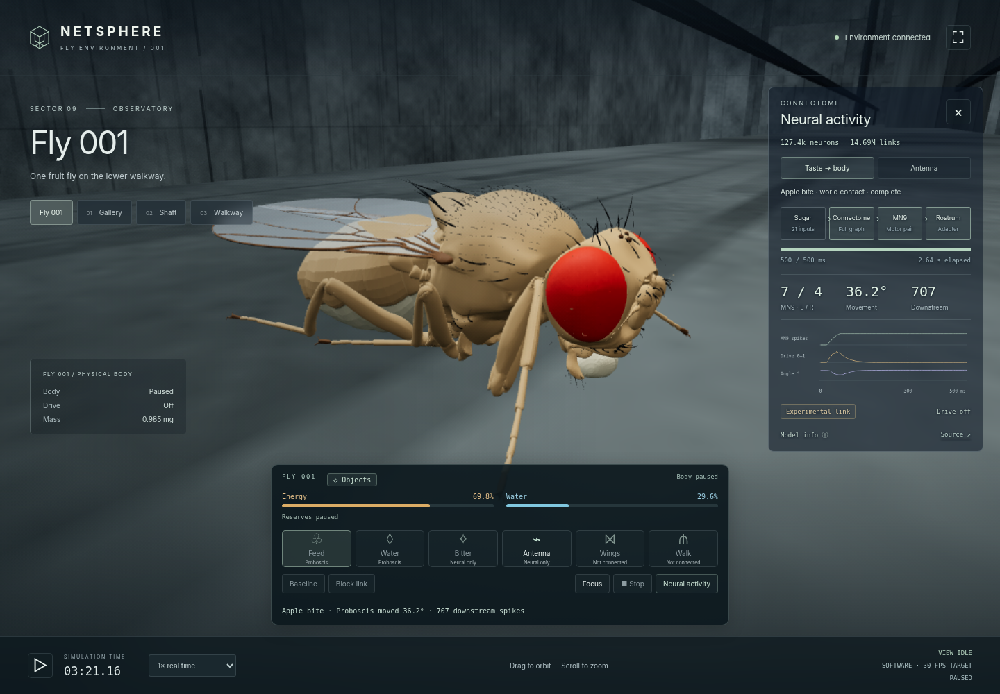
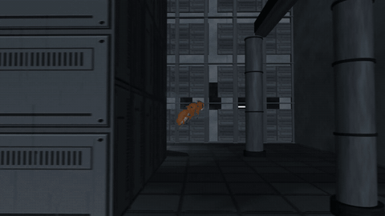

# fly-netsphere

fly-netsphere is building a simulated fruit fly that can explore a city inspired
by *BLAME!* and find food and water. Today, you can offer food at its mouth in
your browser, watch the neural response move its mouth, and keep it alive with
finite portions and visible energy and water reserves.



*The browser after an apple-contact response, with energy, water and neural activity visible.*

## Try it

1. Open **Objects**, choose **Apple** or **Water**, then **Offer at mouth**.
2. Watch the mouth move and the matching reserve rise. Portions are finite and
   disappear when consumed.
3. Open **Neural activity** to see the response. Use **Focus** for a closer look.

Energy and water start at 70% and drain as the simulation runs. If either reaches
zero, the fly dies; **New life** replenishes its reserves. **Pause** freezes time.
The separate **Feed**, **Water**, **Bitter** and **Antenna** buttons let you test
neural responses, but do not supply food.

**Seeking and browser flight are not implemented yet.** An apple placed nearby
will not attract the fly. The [delivery plan](docs/embodied-roadmap.md) defines
the remaining work and the test that closes it: distant source → physical
approach and landing → consumption → renewed search.

## Run locally

You need Docker and a browser with WebGL 2. The browser environment runs its
physics and neural model on the CPU; no NVIDIA GPU is required.

For the first run, follow these setup guides in order:

1. [Prepare the browser dependencies and fly body](docs/browser-environment.md#start).
2. [Download, prepare and validate the neural data](docs/neural-reference.md#resources-and-preparation).

Once prepared, start the environment:

```bash
docker compose --profile dev up -d --no-build environment-dev
```

Open **http://localhost:8089**. To stop:

```bash
docker compose stop environment-dev
```

## How it works

The body comes from **flybody**, an anatomical fruit-fly model simulated in
**MuJoCo**. The neural model uses the published **FlyWire 630** wiring map:
127,400 neurons and 14,687,178 directed connections. **Three.js / WebGL 2**
renders the world and measured body poses.

Mouth contact activates taste neurons. Their signals propagate through the neural
model, and an experimental adapter turns MN9 neuron activity into mouth movement.
Contact and measured movement allow intake; consuming a portion removes that
source of sensory input.

Neural responses run as short trials. Energy, water and death follow simple
survival rules. The planned locomotion combines neural behavioral commands with
learned leg and wing controllers. The [feeding guide](docs/habitat.md) explains
the existing contact loop; the [delivery plan](docs/embodied-roadmap.md) covers
continuous sensing and movement.

## Watch it fly

There is also a separate flight-recording pipeline. It uses flybody's pretrained
motor controller and a navigator that reads the city geometry. This flight is
not driven by the browser's neural model.



[Watch the 60-second first-person recording](https://github.com/bitdeep/fly-netsphere/releases/download/pov-stabilization-preview-1/blame_pov_60s-fly_city_stabilized.mp4)
or [download the third-person take and validation files](https://github.com/bitdeep/fly-netsphere/releases/tag/v0.1.0).

To record your own, you need an NVIDIA GPU and Docker's NVIDIA container runtime:

```bash
make build                         # download pinned sources/data and build the image
make take VIEW=first-person        # simulate, render and verify a 60-second take
```

Recordings go into `out/take_<timestamp>/`. Allow roughly 15 minutes of simulation
compute per recorded minute on an RTX 4090, plus rendering and initial kernel
compilation.

## Go deeper

| Guide | What it covers |
|---|---|
| [Browser environment](docs/browser-environment.md) | Setup, controls and development |
| [Feeding and survival](docs/habitat.md) | Contact, consumption, reserves and tests |
| [Neural model](docs/neural-reference.md) | Data sources, equations and numerical checks |
| [Brain-to-body link](docs/motor-link.md) | Motor adapter and causal comparisons |
| [Delivery plan](docs/embodied-roadmap.md) | Remaining work and end-to-end acceptance for food seeking and flight |
| [Flight recordings](docs/stabilized-pov.md) | Camera, downloads and replay validation |
| [Flight measurements](docs/netsphere-validation.md) | Performance and physical checks (Portuguese) |

## Credits

Built on [flybody](https://github.com/TuragaLab/flybody)
([paper](https://www.nature.com/articles/s41586-025-09029-4),
[data](https://doi.org/10.25378/janelia.25309105)),
[Shiu and Spiller's Drosophila brain model](https://github.com/philshiu/Drosophila_brain_model),
[MuJoCo](https://github.com/google-deepmind/mujoco),
[MuJoCo Warp](https://github.com/google-deepmind/mujoco_warp),
[NVIDIA Warp](https://github.com/NVIDIA/warp) and
[dm_control](https://github.com/google-deepmind/dm_control).

The NETSPHERE is a fan homage to Tsutomu Nihei's *BLAME!*, with no official affiliation.

Apache-2.0; see [LICENSE](LICENSE) and [NOTICE](NOTICE).
The neural reference retains its [MIT notice](licenses/drosophila-brain-model-MIT.txt).
