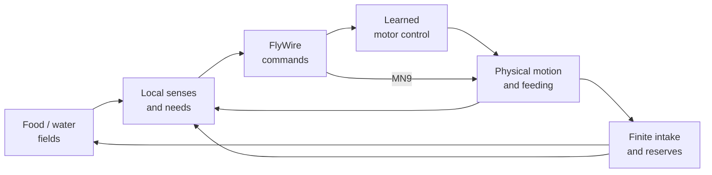

# Delivery plan: seeking food and water

The next release must let one fly find and consume food and water placed away
from its mouth, then search again when needed. Flight, landing and visible
energy/water reserves belong to this delivery. Walking is an intermediate step.
This is the canonical scope and acceptance plan; the linked guides describe
what exists today.

## Current status

| Capability | Status |
|---|---|
| Physical body and city | Native MuJoCo, rendered with Three.js / WebGL 2 |
| Taste → neural activity → mouth movement | Implemented, with causal comparisons |
| Finite portions, reserves, depletion and death | Implemented as simplified resource accounting |
| Distant sensing and neural need signals | Missing |
| Neural commands → learned locomotion → browser body | Missing |
| Search, flight, approach, landing and repeated feeding | Missing; delivery is incomplete |

**Offer at mouth** tests contact feeding. An apple placed nearby produces no
attraction. A browser reproduction on 2026-09-13 observed 25.12 seconds of
physical time with a noncontacting apple: no changed body pose, new motor trial
or intake. Passing [contact tests](habitat.md#resource-bounds-and-verification)
did not cover seeking.

The [recorded flights](stabilized-pov.md) use a learned policy and geometric
navigator in a separate offline pipeline. An exploratory walking-policy port
has produced isolated physical movement; numerical agreement and browser
integration remain unverified. Neither establishes browser locomotion.

## The loop to build

The fly starts with reserves, explores when it needs resources, approaches a
detected source, lands and consumes it. It can rest when supplied and search
again when needed. Uninterrupted flight is not the acceptance condition.

This is the **target architecture**, not the current runtime. Field equations,
need modulation and encoding/decoding gains are engineering approximations.
Apple uses an odor cue; water needs a separate moisture cue or explicitly
artificial channel. A visible halo may illustrate a field; it does not steer.
An exhausted source stops emitting and cannot replenish either reserve.

## Architecture decisions

- **Hybrid control:** the connectome supplies behavioral commands; validated
  flybody policies coordinate legs/wings. Policies and command decoders receive
  no food coordinates, object IDs or precomputed target direction.
- **Physical movement:** native actuators produce motion. Preserve collisions
  and aerodynamics; no pose/velocity writes, interpolated flight or episode
  resets during a run. Cruise flight does not prove takeoff or landing.
- **Same brain:** keep FlyWire 630 and all stored connections. Pin the provenance
  of new sensory/readout IDs. Preserve neural state across controller updates.
- **Same renderer:** keep Three.js / WebGL 2. The current physics and NumPy
  neural core run on a Docker CPU backend, not WASM/WebGPU. Consider a WASM
  solver only against measured need and numerical comparisons on this graph.
- **Separate protocols:** retain the bounded antennal/taste assays as regression
  tools. Their rest-start and rostrum-only rules apply to those experiments;
  locomotion needs its own clock, actuator allowlist and cancellation contract.

The runtime may enforce physical transition guards, resource limits and death.
It must not select a source or inject steering behind a neural display. Saturated
activity or unusable directional readouts fail the neural gate; do not hide them
with pruning, repeated state resets or a scripted pilot.

## Delivery order

Complete the first failing gate before unrelated work. **All four are pending.**
Update status only with implementation and measured evidence.

| Gate | Work | Required evidence |
|---|---|---|
| 1. Continuous sensory decisions | Pin bilateral sensory/readout mappings, encode separate deficits and retain neural state | Left/right responses, changes after source relocation/removal, no-input and blocked-path comparisons, bounded activity and measured runtime |
| 2. Physical locomotion | Validate official walking inference, connect neural commands, then integrate flight and transitions | Forward/left/right/stop through actuators; blocked commands remove commanded motion; physical takeoff, sustained flight and landing |
| 3. Find and consume | Connect fields, locomotion, mouth contact and reserves in the browser | Distant apple and water each replenish the correct reserve; exhausted sources disappear; another source is found |
| 4. Complete release | Run actual UI, causal controls and sustained workload checks | Every acceptance case below passes on the identified commit, documentation matches and CI is green |

**Gate 1 failed the first sensory feasibility measurements (2026-09-13).**
The original full-graph odor response persisted after input ended. An explicitly
separate adaptive-threshold experiment recovered rest in six repeats but lost
the response to the second cue and supplied no usable direction.
See the [protocol, numerical comparisons and results](sensory-feasibility.md).
The reference core and live assays remain unchanged.

**Next implementation task: resolve the sensory path and bilateral readout
mapping, including responsiveness to a second cue.** Adaptation alone did not
pass this gate; it is not ready for motor integration. The isolated walking
probe starts gate 2; the recorded flight controller supplies a cruise reference,
not a validated transition system.

## Next investigations

The navis and hae sources were inspected on 2026-09-13. Neither candidate is
integrated into the project; their reported learning and performance results
remain unverified locally. These investigations support the existing gates:

| Investigation | Place in the plan | Evidence needed before adoption |
|---|---|---|
| **Anatomy with navis** | First: resolve gate 1's sensory and steering candidates | A small, sourced table of FlyWire 630 IDs, sides, cell types and connections; morphology comparisons with explicit units and brain spaces |
| **Continuous directional response** | Next in gate 1, using the checked mappings | Repeated left/right cues and removal without resetting neural state; useful readouts on the second cue; no-input and blocked-path controls |
| **Event-driven C/WASM core** | Address the measured neural runtime shortfall in gates 1 and 4 | Compare the same full graph and inputs with the reference; check spike IDs/ticks, state tolerances, sleep/wake and chunk continuity; measure CPU, memory and coupled-clock performance |
| **Learning from intake** | Experimental extension once repeated sensory responses work, supporting gates 1 and 3 | Cue-specific changes that persist; learning-off and unpaired-feedback controls; improved behavior on unseen placements, without giving the controller source coordinates |

**navis is an analysis tool in this plan.** Use it on the small set of candidate
neurons before considering larger datasets. NBLAST can suggest morphological
matches; it does not establish steering function. Keep skeleton/mesh versions,
coordinate transforms and units explicit. Aligning two brain spaces does not
make their neuron IDs interchangeable, and the default neuPrint hemibrain example
is not our FlyWire 630 specimen.

**The C/WASM candidate addresses computation.** The useful idea is to skip
integration when a bound proves a neuron cannot reach threshold before another
input, then advance its state when needed. Preserve every connection and the
coupled clock. Faster execution does not resolve persistent activity or missing
direction; verify resource bounds and numerical agreement before replacing any
solver.

**Learning is a separate model experiment.** The proposed feedback is the measured
replenishment of the reserve currently in deficit, associated with recent sensory
activity. This is an engineering hypothesis. Specify the plastic synapses,
feedback rule and limits before testing, preserve the fixed reference assays,
and require the learned response to work with continuous state and the full graph.
An isolated circuit assay may diagnose learning but cannot close the foraging gate.

## Acceptance through the browser

Use a dedicated fixture with one live fly, initial 70% reserves, reactive senses
on and no source touching the mouth. Use **Place in world**, never **Offer at
mouth**, for seeking tests. Save reachable left/front/right positions 1 cm from
the initial body on an unobstructed surface within the existing placement limit.

The initial release targets are intake within **60 simulated seconds per source**
and at least **0.5× physical/wall-clock speed** over the active sequence. These
are targets, not measured performance. Test each position with three fixed seeds;
save all nine outcomes and require all to pass. Fix coordinates, seeds and
thresholds before tuning; document any necessary revision.

| Case | Pass condition |
|---|---|
| Apple at a distance | Sensor changes → neural commands → physical approach → feeding; energy transfers from the finite portion until it empties |
| Water at a distance | The same chain transfers water; that intake creates no energy |
| Apple → water → new apple | One life completes all three, with physical flight and landing during the sequence; no body or neural-state reset |
| Move/remove the source | Subsequent readings and commands respond; no pursuit of cached target coordinates |
| Disable relevant senses | Source-directed behavior is lost in the comparison; no intake while senses are disabled |
| Block neural motor commands | Sensory activity remains measurable, commanded locomotion disappears and distant food is not consumed |
| No food / no water | Each deprivation independently causes terminal death; no further neural actuation or automatic revival |
| Pause / Stop / New life | Freeze coupled time and reserves / cancel controller authority without automatic retry / restore reserves while preserving physical pose and objects |

Contact, baseline, bitter and conservation checks remain component regressions.
They cannot substitute for this suite. Record body position, local sensors,
neural readouts, actuator commands/forces, contact and resource transfers on one
timeline, bound to code/data/controller hashes. Include a continuous capture of
flight, landing, intake and departure; a screenshot is insufficient.

Measure physical/wall time, CPU, peak RAM and physics warnings for the combined
workload. Keep one animal, 2 CPUs / 1 GiB and the existing 0.9-core physics and
separate 0.15-core antennal duty budgets. Report actual rendering FPS separately
from physics speed; target 30 FPS while moving, with no idle/hidden-tab draws.
Check desktop and 390×844 controls. A guard trip is a failed run.

## Reference projects and limits

**navis — inspected commit
[cb9a591](https://github.com/navis-org/navis/tree/cb9a5915b6b3587cb81154f4f77ffc62fe12b03a).**
It provides morphology analysis, NBLAST, template transforms and visualization,
with Rust-accelerated functions. Its
[coordinate guidance](https://github.com/navis-org/navis/blob/cb9a5915b6b3587cb81154f4f77ffc62fe12b03a/scripts/llms_preamble.md)
warns that comparisons across incompatible brain spaces can return plausible
but incorrect results. The
[neuPrint interface](https://github.com/navis-org/navis/blob/cb9a5915b6b3587cb81154f4f77ffc62fe12b03a/docs/examples/4_remote/tutorial_remote_00_neuprint.py)
requires a dataset selection and authenticated access. Plan offline analysis in
Docker with selected dependencies; keep Three.js for the browser and flybody for
physical motor execution. Blender exports can wait for presentation work.

**hae — inspected commit
[edb1532](https://github.com/satorunet/hae/tree/edb1532fbe83ae3d21adb12072c12f3f86c4e607).**
Its [C core](https://github.com/satorunet/hae/blob/edb1532fbe83ae3d21adb12072c12f3f86c4e607/flybrain/src/brain.c)
contains event-driven integration and an added dopamine-gated plasticity rule.
The roughly 19 KB WASM file is executable code; graph data and learned weights
are loaded separately. The
[conditioning experiment](https://github.com/satorunet/hae/blob/edb1532fbe83ae3d21adb12072c12f3f86c4e607/flybrain/test/learn.mjs)
is a useful reference for paired and control odors, not a reproduced result here.

The [character reader](https://github.com/satorunet/hae/blob/edb1532fbe83ae3d21adb12072c12f3f86c4e607/juku/reader.mjs)
uses v783, disables outgoing transmission outside the mushroom-body circuit and
resets neural state for each image while retaining learned gains. It assigns
output groups to letters and receives the correct label during error feedback.
This does not demonstrate a continuously operating full brain finding resources.
Our separate [v630 odor measurements](sensory-feasibility.md) also show persistent
activity; the releases and protocols remain distinct.

The [main scene](https://github.com/satorunet/hae/blob/edb1532fbe83ae3d21adb12072c12f3f86c4e607/suji/flag.js)
uses predefined writing strokes with inverse kinematics, programmed food approach
and interpolated flight. Its
[worker](https://github.com/satorunet/hae/blob/edb1532fbe83ae3d21adb12072c12f3f86c4e607/juku/worker.js)
uses writing speed to drive displayed motor-neuron activity; that display does
not prove those neurons caused the movement. These animations do not replace
our neural-command-to-physical-actuator checks.

Any reuse requires pinned code/data, dependency and license review, bounded
isolated execution and the relevant numerical and behavioral comparisons.

## Deferred work

Touch/escape, learned vision, a reconstructed VNC, multiple flies, city expansion
and texture polish wait until this loop passes. [Earlier city ideas](netsphere-ideas.md)
are a historical backlog. Additional diagrams, recordings or interface polish
do not close a failed behavior gate.
