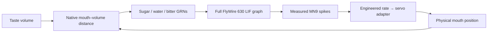

# Object gallery and contact reflex

At **http://localhost:8089**, open **Objects** in the fly action bar.
Select **Fruit**, **Water**, **Bitter** or **Neutral**, then:

- **Offer at mouth** places a taste volume at the measured right mouthpart and
  focuses the observer on the head. It never moves the animal.
  On a narrow screen, the gallery closes so the response stays visible.
- **Place in world** arms a surface picker. Click a surface within 3 cm of the
  fly; Escape cancels. A distant source does not produce taste input.
- **React to objects** enables/disables world taste input.
- **×** removes that particular source, including during a neural response.

The gallery holds four stationary, permeable **0.5 mm diameter taste volumes**.
They are neither rigid fruit nor simulated fluid. Fruit encodes sugar; water
and bitter select their published sensory groups; neutral is a no-input control.
Objects do not emit odor, get consumed or move the body by collision.

## What reacts

The full published FlyWire 630 LIF graph and the existing
[MN9-to-rostrum adapter](motor-link.md) calculate the response:



`mj_geomDistance` measures overlap with flybody's
`fly_001/labrum_right_lower_collision`. The published sensory group belongs to
the right labellum; using this flybody mouth geometry as its receptor surface is
an explicit approximation. Any overlap gates the fixed 200 Hz Poisson input.
This binary encoding models neither receptor density nor taste concentration.

Contact can start **one 500 ms response per placed object**, after physical rest
and with no other assay running. Neural state starts at rest with the same seed
as manual trials. During that response, contact is sampled every 5 ms of shared
physical/neural time and gates the first 300 ms of candidate sensory events.
The remaining 200 ms are recovery. Losing contact, removing the object or
disabling reactive senses blocks subsequent external events at the next sample;
activity already propagating through the graph can continue.
Before a response, sensing follows bounded native physics blocks, up to 25 ms
apart when the body is asleep; it does not wake an extra polling worker.

The action result and inspector identify the object that triggered a trial.
Trace tooltips include the sampled contact state. **Contact recorded** is a
latched result, not a claim that the mouth still touches that object.
Re-offering requires a new placement. Multiple contacting objects are processed
in placement order, never as simultaneous neural trials. Manual presets retain
their direct-input protocol; switch off reactive senses when comparing manual
trials without queued world responses.

This closes a small sensory–motor feedback loop, **not continuous autonomy**.
There is no hunger, learning, foraging, walking, flight or escape controller.
See the [embodiment roadmap](embodied-roadmap.md) for the remaining motor layer.

## Resource bounds and verification

Four precompiled mocap bodies carry noncolliding sensory volumes. Only their
positions change on placement/removal; fly position and velocity are untouched.
No recompilation, physics thread, dependency, GPU compute or larger resource
limit is added. Sensing has at most four distance queries per sample and ceases
after all sources are used. The shared 0.9-core physics budget and 2 CPU / 1 GiB
container ceiling remain in place.

The browser shares one 16×12 sphere geometry and four materials across four
preallocated meshes. Objects cast no shadows; revisions suppress repeated
transfers, DOM writes and idle scene redraws. Only four small records are sent.

Run the real graph/anatomy checks in the disposable 0.5 CPU / 512 MiB tools:

```bash
LOCAL_UID="$(id -u)" LOCAL_GID="$(id -g)" \
  docker compose --profile neural-tools run --rm --no-deps \
  -e FLY_NEURAL=1 neural-tools \
  python scripts/validate_habitat.py --output /out/habitat-validation.json
```

The independent settled fixtures measured:

| World intervention | Sensory-neuron spikes | Downstream spikes | Peak rostrum excursion |
|---|---:|---:|---:|
| Fruit held at mouth | 1,237 | 3,839 | 40.03° |
| Water held at mouth | 1,055 | 1,293 | 29.96° |
| Bitter held at mouth | 1,237 | 677 | 0° |
| Fruit removed at 50 ms | 210 | 770 | 38.56° |
| Reactive senses disabled at 50 ms | 210 | 770 | 38.56° |

The shortened input still evokes a motor response: removing food does not erase
earlier spikes or instantaneously stop physical motion. No-contact, neutral and
disabled-senses controls evoke no trial. Checks also cover command bounds,
unchanged animal state during object operations, mutual exclusion, one response
per placement, 500 ms clock agreement, excluded actuators and delta transport.
There were no physics warnings or forces from excluded actuators. Peak RSS was
222 MiB; fruit used about 2.29 CPU seconds, water 1.94 and bitter 0.36.
These finite experiments do not predict continuous locomotion performance.
The ignored report binds the implementation and graph cache by SHA-256.

Browser checks exercised all object types, the four-slot limit, surface placement,
Escape cancellation, individual removal and disabling/re-enabling reactive
senses. Fast bitter responses retained their source and result even when they
finished between idle event updates. All 12 manual preset/mode combinations
also passed through actual button clicks, including comparison tooltips visible
before switching presets. Stop cancelled both trial types; Focus changed only
the observer.

At 390×844 there was no horizontal overflow or inspector/action-bar overlap.
The gallery and neural inspector replaced one another on that narrow screen;
offering food closed the gallery and exposed the response. Trace tooltips
included measured contact. No JavaScript exceptions or HTTP failures were
recorded. A software graphics context reset during viewport resizing recovered.
The isolated browser was closed after testing.

A three-second sample per workload, with one viewer and a resting fly:

| Workload | CPU, percent of one core | Container memory |
|---|---:|---:|
| Empty gallery | 13.18% | 176.17 MiB |
| Four untouched sources awaiting contact | 9.59% | 175.95 MiB |
| Sources removed | 10.07% | 175.95 MiB |

These noisy short samples establish that this workload fit the existing bounds,
not that adding objects reduces CPU use. The renderer retained 14 geometries
through placement/removal, sharing the one added sphere geometry. A separate
eight-second stationary observation produced zero new frames while physical
time advanced. This does not benchmark hardware-accelerated FPS or locomotion.
