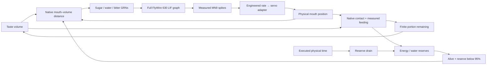

# Finite food, survival reserves and contact reflexes

This guide covers the implemented contact-feeding loop. **Food placed near the
fly does not attract it:** distant sensing and locomotion are missing. The
[delivery plan](embodied-roadmap.md) defines seeking-and-flight acceptance;
offering food directly at the mouth does not satisfy it.

At **http://localhost:8089**, open **Objects** in the fly action bar.
Select **Apple**, **Water**, **Bitter** or **Neutral**, then:

- **Offer at mouth** places a taste volume at the measured right mouthpart and
  focuses the observer on the head. It never moves the animal.
  On a narrow screen, the gallery closes so the response stays visible.
- **Place in world** arms a surface picker. Click a surface within 3 cm of the
  fly; Escape cancels. A distant source does not produce taste input.
- **React to objects** enables/disables world taste input.
- **×** removes that particular source, including during a neural response.

The gallery holds four stationary, permeable **0.5 mm diameter taste volumes**.
They are neither rigid fruit nor simulated fluid. Apple encodes sugar; water
and bitter select their published sensory groups; neutral is a no-input control.
Objects do not emit odor or move the body by collision. Apple and water contain
finite resource portions, consumed through the explicit intake approximation below.

## Energy, water and life

The two action-bar meters are always visible. Each reserve starts at **70%**.
Energy loses **0.2 percentage points per executed physical second**, water **0.3**.
Pause freezes both. Slow motion and expensive physics slow their wall-clock
depletion too; opening another viewer does not accelerate the shared animal.
Without intake, water runs out after about **233.3 simulated seconds**.
These game-scale constants are not measured fruit-fly metabolism.

An apple bite holds **20 percentage points of energy**, a water drop **20 of
water**. Neither substitutes for the other. Transfer requires a world-triggered
stimulus trial, measured MN9 spikes, nonzero native rostrum force, at least **1°**
of joint displacement from its trial-start angle and current native mouth overlap.
It proceeds at up to **5 reserve capacities per physical second**, clamped by
the source's remainder and the reserve's free capacity. Both sides receive the
same transfer; none is minted, discarded at saturation or transferred twice.
Source removal and disabling senses stop intake immediately.

This models intake as resource accounting, **not swallowing or digestion**.
Bitter, neutral, distant sources, baseline, blocked actuation and direct preset
buttons do not replenish anything. An empty portion disappears and releases its
slot; partial portions retain a visible remaining percentage.

Either reserve reaching zero **ends this simulated life**. The backend cancels
neural/motor trials and rejects new ones; passive body physics remain intact.
There is no scripted collapse, automatic revival or pose reset. **New life**
restores starting reserves and resets the life age/consumption counters, preserving
physical state, objects and Pause. It is available only after death. Page reload
preserves the life; restarting the development backend starts a fresh experiment.

## What reacts

The full published FlyWire 630 LIF graph and the existing
[MN9-to-rostrum adapter](motor-link.md) calculate the response:



`mj_geomDistance` measures overlap with flybody's
`fly_001/labrum_right_lower_collision`. The published sensory group belongs to
the right labellum; using this flybody mouth geometry as its receptor surface is
an explicit approximation. Any overlap gates the fixed 200 Hz Poisson input.
This binary encoding models neither receptor density nor taste concentration.

Contact can start a **500 ms response**, after physical rest
and with no other assay running. Neural state starts at rest with the same seed
as manual trials. During that response, contact is sampled every 5 ms of shared
physical/neural time and gates the first 300 ms of candidate sensory events.
The remaining 200 ms are recovery. Losing contact, removing the object or
disabling reactive senses blocks subsequent external events at the next sample;
activity already propagating through the graph can continue.
Before a response, sensing follows bounded native physics blocks, up to 25 ms
apart when the body is asleep; it does not wake an extra polling worker.

The action result and inspector identify the object that triggered a trial.
Trace tooltips include the sampled contact state. **Contact recorded** is a
latched result, not a claim that the mouth still touches that object.
Remaining apple/water portions can retry after at least **two physical seconds
between starts**, when the matching reserve is below 95%, the body is at rest and
no other trial runs. Each retry resets neural state; this is explicitly episodic,
not a continuous brain hunger signal. Bitter and neutral retain one response per
placement. **Stop** on a world-triggered trial disables **React to objects** as
well, preventing a stopped response from restarting. Multiple contacting objects are processed
in placement order, never as simultaneous neural trials. Manual presets retain
their direct-input protocol; switch off reactive senses when comparing manual
trials without queued world responses.

This closes a small sensory–motor feedback loop, **not continuous autonomy**.
There is no neural hunger/thirst circuit, learning, foraging, walking, flight or escape controller.
See the [delivery plan](embodied-roadmap.md) for sensory and motor integration.

## Resource bounds and verification

These checks establish contact feeding and reserve accounting. Their no-contact
cases intentionally expect no response. Seeking needs the separate
[distant-source suite](embodied-roadmap.md#acceptance-through-the-browser);
none of the results below establishes attraction, walking or flight.

Four precompiled mocap bodies carry noncolliding sensory volumes. Only their
positions change on placement/removal; fly position and velocity are untouched.
No recompilation, physics thread, dependency, GPU compute or larger resource
limit is added. Sensing has at most four distance queries per sample; intake adds
one native mouth query per driven physical step for a matching food source.
Used nonfood controls cease sensing, and death stops world sensing.
The shared 0.9-core physics budget and 2 CPU / 1 GiB
container ceiling remain in place.

The browser shares one 16×12 sphere geometry and four materials across four
preallocated meshes. Objects cast no shadows; revisions suppress repeated
transfers, DOM writes and idle scene redraws. Only four small records are sent.

Run the real graph/anatomy checks in the disposable 0.5 CPU / 512 MiB tools:

```bash
LOCAL_UID="$(id -u)" LOCAL_GID="$(id -g)" \
  docker compose --profile neural-tools run --rm --no-deps \
  -e FLY_NEURAL=1 neural-tools \
  python scripts/validate_habitat.py --output /out/habitat-validation.json
```

The independent **non-consuming contact-assay** fixtures measured:

| World intervention | Sensory-neuron spikes | Downstream spikes | Peak rostrum excursion |
|---|---:|---:|---:|
| Fruit held at mouth | 1,237 | 3,839 | 40.03° |
| Water held at mouth | 1,055 | 1,293 | 29.96° |
| Bitter held at mouth | 1,237 | 677 | 0° |
| Fruit removed at 50 ms | 210 | 770 | 38.56° |
| Reactive senses disabled at 50 ms | 210 | 770 | 38.56° |

The shortened input still evokes a motor response: removing food does not erase
earlier spikes or instantaneously stop physical motion. No-contact, neutral and
disabled-senses controls evoke no trial. Checks also cover command bounds,
unchanged animal state during object operations, mutual exclusion, one response
per placement in assay-only mode, 500 ms clock agreement, excluded actuators and delta transport.
There were no physics warnings or forces from excluded actuators. Peak RSS was
222 MiB; fruit used about 2.29 CPU seconds, water 1.94 and bitter 0.36.
These finite experiments do not predict continuous locomotion performance.
The ignored report binds the implementation and graph cache by SHA-256.
It deliberately runs contact assays without reserve accounting. The consuming
runtime is checked independently:

```bash
LOCAL_UID="$(id -u)" LOCAL_GID="$(id -g)" \
  docker compose --profile neural-tools run --rm --no-deps \
  -e FLY_NEURAL=1 neural-tools \
  python scripts/validate_survival.py --output /out/survival-validation.json
```

The survival checks exercise the real full graph and native body, source
conservation, empty-slot removal, matching reserves, no pre-spike intake, direct
preset/no-contact/baseline/blocked controls, removal and disabled senses,
cooldown/satiety, Stop, both death causes, actuator cancellation, restart without
pose writes, real-worker Pause and delta telemetry. `test_survival.py` additionally
checks time partitioning, terminal-state persistence and capacity conservation
without neural data; it runs in CI.

With consuming portions in the settled fixture, the apple transferred **20 energy
points** (1,134 downstream spikes, 40.89° excursion) and water transferred **20
water points** (489 downstream spikes, 2.19°). Both freed their slot. These counts
differ from the non-consuming assay above because an emptied source stops future
taste input. Removing the apple or disabling senses at 50 ms stopped intake at
9.7 points. Baseline, blocked, bitter, distant and direct-preset cases transferred
zero. The survival process peaked at 222 MiB RSS; apple used 2.36 CPU seconds,
water 1.86. Resource limits were unchanged.

Browser checks exercised all object types, the four-slot limit, surface placement,
Escape cancellation, individual removal and disabling/re-enabling reactive
senses. Fast bitter responses retained their source and result even when they
finished between idle event updates. All 12 manual preset/mode combinations
also passed through actual button clicks, including comparison tooltips visible
before switching presets. Stop cancelled both trial types; Focus changed only
the observer.

At 390×844 there was no horizontal overflow or inspector/action-bar overlap.
The gallery and neural inspector replaced one another on that narrow screen;
offering food closed the gallery and exposed the response. Trace tooltips
included measured contact. No JavaScript exceptions or HTTP failures were
recorded. A software graphics context reset during viewport resizing recovered.
The isolated browser was closed after testing.

A three-second sample per workload, with one viewer and a resting fly:

| Workload | CPU, percent of one core | Container memory |
|---|---:|---:|
| Empty gallery | 13.18% | 176.17 MiB |
| Four untouched sources awaiting contact | 9.59% | 175.95 MiB |
| Sources removed | 10.07% | 175.95 MiB |

These noisy short samples establish that this workload fit the existing bounds,
not that adding objects reduces CPU use. The renderer retained 14 geometries
through placement/removal, sharing the one added sphere geometry. A separate
eight-second stationary observation produced zero new frames while physical
time advanced. This does not benchmark hardware-accelerated FPS or locomotion.

## Survival interface check

The reserve update was also exercised through actual browser controls: apple and
water offers depleted their portions and replenished the correct bars; natural
water exhaustion ended life at 233.3 simulated seconds and survived a page reload.
New life restored 70% reserves while preserving Pause. All 12 manual preset/mode
combinations remained usable, and Stop cancelled both motor and antennal trials.
Mouse/click and keyboard hints, Focus, inspector/gallery toggles and a
comparison-to-Water transition worked. Disabled senses retained a 100% portion
until explicit removal.

At 390×844 there was no horizontal overflow: the inspector ended at 471 px and
the action bar started at 525 px. The reserve strip stayed visible. The observer
now frames the fly above the bar; wide, short windows use taller side panels so
gallery controls remain reachable. Software WebGL recovered after resizing;
no JavaScript exceptions were observed.

A seven-second resting observation advanced physics by 7.003 seconds and used
2.1 water points while producing **zero new 3D frames**. Geometry and texture
counts remained 14 and 5 after object use/removal. Short container point samples
were 9.13% of one core / 162.8 MiB before the update and 9.70% / 144.4 MiB after
with the isolated viewer. Different warm-up histories and a single sample do
not establish a speed or memory improvement; both fit the existing ceilings.
