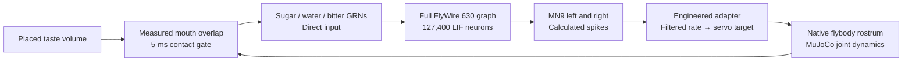

# Experimental MN9-to-proboscis link

The browser can now turn **simulated FlyWire motor-neuron spikes into a physical
flybody joint response**. This first link uses published taste-sensory neurons
and the MN9 motor pair. It drives only the rostrum, part of the proboscis.

Open **http://localhost:8089** and use **Feed**, **Water** or **Bitter** in the
action bar. **Feed** stimulates sugar neurons: it models feeding initiation, not
eating or digestion. **Focus** points the observer at the head; drag to choose
an angle. **Neural activity** opens a transparent, read-only inspector retaining
measured MN9 spikes, adapter drive and joint angle. Hover, focus or tap components
and numbers for details; point along the graph to inspect 5 ms samples.
The action bar stays available with the panel closed. Compare **Baseline** and
**Block link** for the selected stimulus.
New trials wait for the body to settle naturally. **Stop** cancels the trial;
the footer pauses or slows both physical and neural time together.



The action-bar presets remain direct-input motor experiments. The
[object gallery](habitat.md) additionally gates those inputs by measured mouth
overlap with a stationary taste volume. Mouth motion and source removal feed
back into that gate during a bounded response. Taste-receptor mechanics are
not reconstructed. Each trial still starts from neural rest and ends at 500 ms;
the brain does not run continuously. There is no autonomous walking/flight
controller or complete ventral nerve cord. **Wings** and **Walk** therefore remain
visibly **Not connected**, with explanations and no command handler. **Antenna**
runs the separate assay and has no motor authority.

The gallery additionally transfers [simplified energy/water reserves](habitat.md)
during native mouth contact with measured rostrum force and at least 1° of
displacement after MN9 spikes. This is an engineered intake gate, not swallowing
or digestion. Direct presets never replenish reserves. Empty portions remove
their taste input; death cancels motor authority. Stopping a world-triggered
trial also disables reactive senses to prevent automatic retries.

## Biological source and engineering boundary

The pinned [Shiu/Spiller notebook](https://github.com/philshiu/Drosophila_brain_model/blob/91bdd1e7dcf193f3e7ca5a8933497fcef63b7960/figures.ipynb)
identifies 21 right labellar sugar GRNs (`neu_sugar`), 18 water GRNs (`neu_water`),
21 bitter GRNs (`neu_bitter`) and two MN9 neurons (`ids_mn9`).
The runtime verifies that notebook's SHA-256 against the graph
manifest and extracts literal IDs without executing cells. The motor IDs are
`720575940660219265` (left) and `720575940645521262` (right).
The [neural reference guide](neural-reference.md) describes the entire retained
graph, LIF equations, numerical agreement and source licenses.

The sensory groups come from the model accompanying
[Shiu et al., *A Drosophila computational brain model reveals sensorimotor processing*, Nature 2024](https://www.nature.com/articles/s41586-024-07763-9).
Our **Bitter** preset stimulates bitter neurons alone. It does not reproduce the
paper's combined sugar-plus-bitter inhibition experiment.

MN9 innervates the rostrum protractor muscle, providing a documented motor
association for this first link. Proboscis movement involves additional muscles
and joints; connecting one servo does not reconstruct that complete system.
See [McKellar et al., *Controlling motor neurons of every muscle for fly proboscis reaching*, eLife 2020](https://elifesciences.org/articles/54978).

The **adapter is our engineering approximation**, not a measured neuromuscular
transfer function or a learned policy. The bilateral MN9 pair is averaged into
one existing flybody rostrum hinge. Each spike contributes to a 30 ms exponential
rate estimate; a mean 100 Hz maps to full drive:

```text
rate[t] = rate[t-1] × exp(-0.1 / 30) + MN9_spikes[t] × 1000 / (2 × 30)
drive[t] = clamp(rate[t] / 100, 0, 1)
rostrum_target[t] = 0.183 + drive[t] × (-1.24 - 0.183) radians
```

The existing position servo, gain, force limit, joint limits, springs, inertia,
contacts and friction calculate the response. No runtime pose or velocity writes
imitate movement. Actuation stays entirely off before the first MN9 spike.
The waveform and gain are not calibrated against an animal's measured kinematics.

## Protocol and isolation

Each trial resets neural state and uses seed `20260912`, while preserving the
body's integrated state and global physical clock. It lasts **500 ms**: 300 ms
of 200 Hz input per selected sensory neuron, then 200 ms without input. The published IDs
are reused; this specific finite-duration protocol is a local assay, not a claim
to reproduce every published feeding experiment.

| Trial | Neural input | Motor link |
|---|---|---|
| Sugar response | Fixed sugar events | MN9 drives the rostrum adapter |
| Water response | Fixed water events | Same MN9-to-rostrum adapter |
| Bitter response | Fixed bitter events | Same adapter; no MN9 spikes in this protocol |
| Baseline | None | No spikes and no actuator drive |
| Block link | Identical selected sensory events | Normal brain activity; actuation disabled |
| World contact | Selected events gated by mouth overlap | Same MN9 adapter; finite food can retry after rest/cooldown |

One neural step precedes one native physical step, both **0.1 ms**, on the same
worker. A mismatch stops the trial. Pause freezes both clocks; paused time does
not consume the 90-second active wall-time allowance. Other guards are 10 CPU
seconds and 100,000 spikes, checked every 25 steps. Stop, completion and exceptions
disable actuation and release neural dynamic state.

Actuator groups allow only `fly_001/rostrum`; every other actuator is disabled.
A sleeping body is woken using MuJoCo's documented **negative-zero applied-force
signal**, which adds no nonzero external force. Sleep is disallowed while the
servo is driven and restored afterwards. See the [MuJoCo sleeping documentation](https://mujoco.readthedocs.io/en/stable/programming/simulation.html#sleeping-islands).
The body then settles under its passive dynamics.

The graph is shared read-only with the antennal lab. Trials are mutually exclusive,
use the existing 0.9-core physics duty budget and keep the dev ceiling of
2 CPUs / 1 GiB. Telemetry is bounded to 100 measured samples, emitted only when
changed; the browser adds no continuous idle animation. No new dependencies,
GPU compute allocation or persistent container is required.

## Validation

Run the causal checks in the existing disposable tooling image:

```bash
LOCAL_UID="$(id -u)" LOCAL_GID="$(id -g)" \
  docker compose --profile neural-tools run --rm --no-deps \
  -e FLY_NEURAL=1 neural-tools \
  python scripts/validate_motor_bridge.py --output /out/motor-validation.json
```

The comparison clones the same settled **test** state for each intervention using
MuJoCo's complete data copy. The live service never resets the fly for a trial.
Checks cover unchanged state at start and before the first motor spike, shared
clocks, native wake, excluded actuators, concurrent trial rejection, cancellation
while paused, delta telemetry and failure on clock mismatch. They also reject
unsupported stimulus presets through the command interface and check that
antennal cancellation allows a fresh trial.

Measured on 2026-09-12:

| Trial | MN9 left / right spikes | Downstream spikes | Peak rostrum movement | Other actuator force |
|---|---:|---:|---:|---:|
| No input | 0 / 0 | 0 | 0° | 0 |
| Sugar, link blocked | 30 / 17 | 3,839 | 0° | 0 |
| Sugar response | 30 / 17 | 3,839 | 40.03° | 0 |
| Water, link blocked | 14 / 7 | 1,293 | 0° | 0 |
| Water response | 14 / 7 | 1,293 | 29.96° | 0 |
| Bitter, link blocked | 0 / 0 | 677 | 0° | 0 |
| Bitter response | 0 / 0 | 677 | 0° | 0 |

The first motor force occurs at the first MN9 spike: **25.5 ms for sugar** and
**76.2 ms for water**, in simulated time. Sugar has 5,076 total spikes (1,237
input); water has 2,348 (1,055 input); bitter has 1,914 (1,237 input). Blocking
the motor link preserves each preset's neural counts while removing actuation.
Neural and physical clocks each advance 500 ms; all checks
complete without physics warnings. These establish a causal software-to-actuator
path, not biological equivalence, real-time performance or autonomous behavior.

The ignored `out/neural-reference/motor-validation.json` records code/cache
hashes, protocol, counts, force, clock alignment, CPU/wall time and peak RSS.
The expanded validation process peaked near 231 MiB RSS; the sugar trial used
about 2.2 CPU seconds and water about 1.9 CPU seconds. After closing the isolated
browser, a resting-service sample showed 146.5 MiB and 7.82% of one CPU core.
These are observations of specific workloads, not performance guarantees.

Earlier browser checks exercised all three sugar modes, head focus, pause/resume with both
clocks frozen, cancellation with drive off, and the retained antennal assay
(2,906 total / 706 downstream spikes). The baseline and motor-blocked trials
added no new 3D frames to the settled scene.

The action-bar check exercised all four sensory presets, water with the motor
link blocked while the panel was closed, and antennal Stop followed by a fresh
trial. Water produced about 30° of movement; bitter produced 677 downstream
spikes, no MN9 spikes, no movement and no additional scene frames. A later sugar
trial moved about 39.5°: live joint excursions depend on the naturally settled
starting pose. The fixed-state validation above is the reproducible comparison.
Desktop and 390×844 mobile layouts had no horizontal overflow or panel/bar
overlap. Pointer, click and keyboard-focus tooltips showed measured values, and
Escape dismissed them. No JavaScript exceptions or failed requests were observed.
Resizing the software-rendered viewport caused a graphics-context reset that
recovered. This does not establish hardware FPS. The isolated browser was closed.

The [browser guide](browser-environment.md) covers rendering limits and operation.
