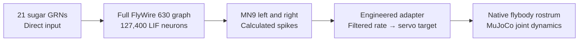

# Experimental MN9-to-proboscis link

The browser can now turn **simulated FlyWire motor-neuron spikes into a physical
flybody joint response**. This first link uses sugar-responsive sensory neurons
and the MN9 motor pair. It drives only the rostrum, part of the proboscis.

Open **http://localhost:8089 → Neural activity → Stimulate sugar neurons**.
**View proboscis** focuses the observer on the head; drag to choose an angle.
The panel retains measured MN9 spikes, adapter drive and joint angle after the
movement. Compare **Baseline · no input** and **Block motor link**.
New trials wait for the body to settle naturally. **Stop** cancels the trial;
the footer pauses or slows both physical and neural time together.



This is an on-demand motor experiment. Input is delivered directly to identified
neurons; no sugar object, taste receptor mechanics, world sensing or physical
feedback into the brain is implemented. There is no autonomous walking/flight
controller or complete ventral nerve cord. The antennal assay remains separately
available and has no motor authority.

## Biological source and engineering boundary

The pinned [Shiu/Spiller notebook](https://github.com/philshiu/Drosophila_brain_model/blob/91bdd1e7dcf193f3e7ca5a8933497fcef63b7960/figures.ipynb)
identifies 21 right labellar sugar GRNs (`neu_sugar`) and two MN9 neurons
(`ids_mn9`). The runtime verifies that notebook's SHA-256 against the graph
manifest and extracts literal IDs without executing cells. The motor IDs are
`720575940660219265` (left) and `720575940645521262` (right).
The [neural reference guide](neural-reference.md) describes the entire retained
graph, LIF equations, numerical agreement and source licenses.

MN9 innervates the rostrum protractor muscle, providing a documented motor
association for this first link. Proboscis movement involves additional muscles
and joints; connecting one servo does not reconstruct that complete system.
See [McKellar et al., *Controlling motor neurons of every muscle for fly proboscis reaching*, eLife 2020](https://elifesciences.org/articles/54978).

The **adapter is our engineering approximation**, not a measured neuromuscular
transfer function or a learned policy. The bilateral MN9 pair is averaged into
one existing flybody rostrum hinge. Each spike contributes to a 30 ms exponential
rate estimate; a mean 100 Hz maps to full drive:

```text
rate[t] = rate[t-1] × exp(-0.1 / 30) + MN9_spikes[t] × 1000 / (2 × 30)
drive[t] = clamp(rate[t] / 100, 0, 1)
rostrum_target[t] = 0.183 + drive[t] × (-1.24 - 0.183) radians
```

The existing position servo, gain, force limit, joint limits, springs, inertia,
contacts and friction calculate the response. No runtime pose or velocity writes
imitate movement. Actuation stays entirely off before the first MN9 spike.
The waveform and gain are not calibrated against an animal's measured kinematics.

## Protocol and isolation

Each trial resets neural state and uses seed `20260912`, while preserving the
body's integrated state and global physical clock. It lasts **500 ms**: 300 ms
of 200 Hz input per sugar neuron, then 200 ms without input. The published IDs
are reused; this specific finite-duration protocol is a local assay, not a claim
to reproduce every published feeding experiment.

| Trial | Neural input | Motor link |
|---|---|---|
| Sugar response | Fixed sugar events | MN9 drives the rostrum adapter |
| Baseline | None | No spikes and no actuator drive |
| Block motor link | Identical sugar events | Normal brain activity; actuation disabled |

One neural step precedes one native physical step, both **0.1 ms**, on the same
worker. A mismatch stops the trial. Pause freezes both clocks; paused time does
not consume the 90-second active wall-time allowance. Other guards are 10 CPU
seconds and 100,000 spikes, checked every 25 steps. Stop, completion and exceptions
disable actuation and release neural dynamic state.

Actuator groups allow only `fly_001/rostrum`; every other actuator is disabled.
A sleeping body is woken using MuJoCo's documented **negative-zero applied-force
signal**, which adds no nonzero external force. Sleep is disallowed while the
servo is driven and restored afterwards. See the [MuJoCo sleeping documentation](https://mujoco.readthedocs.io/en/stable/programming/simulation.html#sleeping-islands).
The body then settles under its passive dynamics.

The graph is shared read-only with the antennal lab. Trials are mutually exclusive,
use the existing 0.9-core physics duty budget and keep the dev ceiling of
2 CPUs / 1 GiB. Telemetry is bounded to 100 measured samples, emitted only when
changed; the browser adds no continuous idle animation. No new dependencies,
GPU compute allocation or persistent container is required.

## Validation

Run the causal checks in the existing disposable tooling image:

```bash
LOCAL_UID="$(id -u)" LOCAL_GID="$(id -g)" \
  docker compose --profile neural-tools run --rm --no-deps \
  -e FLY_NEURAL=1 neural-tools \
  python scripts/validate_motor_bridge.py --output /out/motor-validation.json
```

The comparison clones the same settled **test** state for each intervention using
MuJoCo's complete data copy. The live service never resets the fly for a trial.
Checks cover unchanged state at start and before the first motor spike, shared
clocks, native wake, excluded actuators, concurrent trial rejection, cancellation
while paused, delta telemetry and failure on clock mismatch.

Measured on 2026-09-12:

| Trial | MN9 left / right spikes | Downstream spikes | Peak rostrum movement | Other actuator force |
|---|---:|---:|---:|---:|
| No input | 0 / 0 | 0 | 0° | 0 |
| Motor link blocked | 30 / 17 | 3,839 | 0° | 0 |
| Sugar response | 30 / 17 | 3,839 | 40.03° | 0 |

The first motor force occurs at the first MN9 spike, **25.5 ms of simulated
time**, not wall time. Both stimulated trials have 5,076 total spikes, including
1,237 input spikes. Neural and physical clocks each advance 500 ms; all checks
complete without physics warnings. These establish a causal software-to-actuator
path, not biological equivalence, real-time performance or autonomous behavior.

The ignored `out/neural-reference/motor-validation.json` records code/cache
hashes, protocol, counts, force, clock alignment, CPU/wall time and peak RSS.
The isolated validation process peaked near 215 MiB RSS; the stimulated 500 ms
run used about 2.3 CPU seconds. After the browser trials, a short resting-service
sample showed 149.8 MiB and 8.43% of one CPU core. These are observations of
specific workloads, not performance guarantees.

Browser checks exercised all three modes, head focus, pause/resume with both
clocks frozen, cancellation with drive off, and the retained antennal assay
(2,906 total / 706 downstream spikes). The baseline and motor-blocked trials
added no new 3D frames to the settled scene. Desktop and 390×844 mobile panels
were inspected with no horizontal overflow. All 295 captured requests returned
HTTP 200, with no JavaScript exceptions. Resizing the software-rendered viewport
caused a graphics-context reset that recovered. This does not establish hardware
FPS. The isolated browser was closed after validation.

The [browser guide](browser-environment.md) covers rendering limits and operation.
